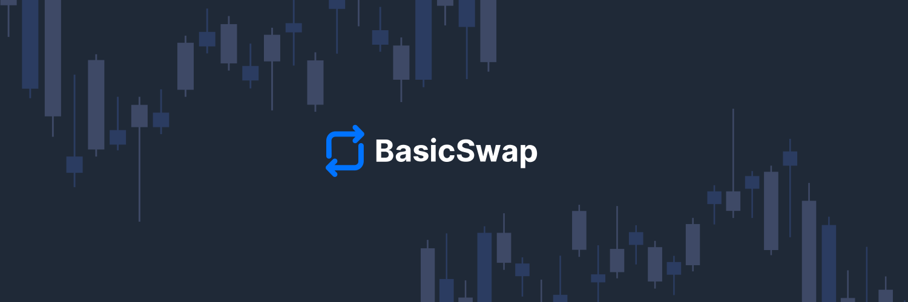

# BasicSwap DEX 

**[Official Website](https://basicswapdex.com)** | **[News](https://particl.news)** | **[Tutorials](https://academy.particl.io)** | **[Chat](https://matrix.to/#/#basicswap:matrix.org)** | **[Terms of Use](https://basicswapdex.com/terms)**

## Hey, Welcome to BasicSwap DEX!

BasicSwap DEX is an open-source project dedicated to creating a decentralized, secure, and user-friendly cryptocurrency trading environment for all. 

The collaborative mission of its contributors is to empower you with true financial sovereignty through innovative blockchain technology and painless cross-chain atomic swaps that possess the same characteristics as direct person-to-person cryptocurrency transactions.  

## What is BasicSwap DEX?

BasicSwap DEX (BSX) is the world's most secure and decentralized exchange, facilitating cross-chain atomic swaps without central points of failure.

### Key Features:
- True cross-chain support via novel adaptor signature based atomic swaps.
- Decentralized order book.
- No third-party intermediaries and non-custodial architecture.
- Zero trading or market making fees.
- Superior financial privacy and data protection.
- Bidirectional support for all supported assets, including Monero (XMR).
- User-friendly interface that requires no technical knowledge.

[Learn more about BasicSwap DEX](https://basicswapdex.com/terms)

## Supported Assets

The BasicSwap DEX protocol currently supports the following digital assets: 

- Bitcoin (BTC)
- Monero (XMR)
- Dash (DASH)
- Litecoin (LTC), with support for full MWEB swaps on the way
- Firo (FIRO)
- PIVX (PIVX)
- Decred (DCR)
- Wownero (WOW)
- Particl (PART)

> Support for other assets, such as ETH and EVM-based tokens, is planned for the future.

## Get Involved

If you are a developer, designer, or blockchain enthusiast and you want to join BasicSwap's community of contributors, you're invited to check out the links below:

1. Explore the [GitHub repositories](https://github.com/basicswap).
2. Join the [community chat](https://matrix.to/#/#basicswap:matrix.org).
3. Follow us on [Twitter](https://twitter.com/BasicSwapDEX).
4. Contribute to related projects (see individual repository guidelines).

## Resources

- [Particl Academy](https://academy.particl.io) - Tutorials and guides
- [BasicSwap Documentation](https://github.com/basicswap/basicswap/tree/master/doc)
- [YouTube Channel](https://www.youtube.com/c/Particl) - Video tutorials and updates

## Contact Information

For support or inquiries, get in touch with the community in the contributors [Matrix chat](https://matrix.to/#/#basicswap:matrix.org).

## Terms of Use

By using BasicSwap DEX, you agree to the terms of use outlined in our [Terms of Use](https://basicswapdex.com/terms) page and **acknowledge that you understand the exclusively decentralized and non-custodial nature of the protocol**.

## Other Projects

While BasicSwap DEX is the primary focus of this community, new ways to push the cryptocurrency ecosystem forward is constantly being explored by its contributors, notably with research of new, better protocols relating to cryptocurrency swaps, privacy, or security. 

Follow us on [X (formerly Twitter)](https://x.com/basicswapdex) to stay up-to-date with all developments and news surrounding the project!

## License

BasicSwap is released under the MIT software license. Please check individual repositories for specific licensing information.
